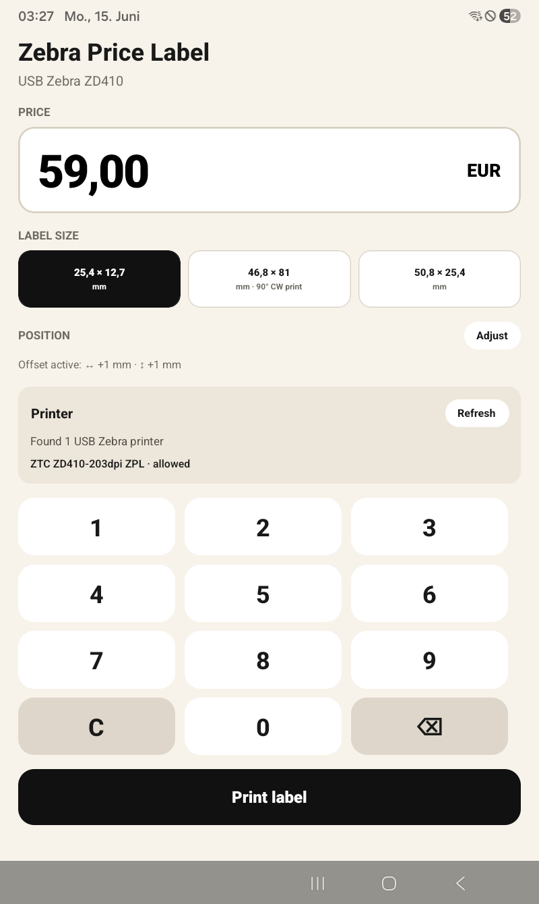

# Zebra Price Label

Android app for printing price labels to a USB-connected **Zebra ZD410** printer.



## Features

- Enter a price on a numeric keypad
- Choose label size (25×13 mm, 46.8×81 mm, 50.8×25.4 mm)
- Print ZPL labels with centered price and black pill styling (small label)
- Fine-tune print position per label size (saved permanently)
- USB Zebra printer discovery and printing

## Requirements

- Node.js ≥ 22.11
- Android SDK and a connected device or emulator
- Zebra ZD410 (or compatible ZPL USB printer)

## Development

```sh
npm install
npm start
npm run android
```

## Build release APK

```sh
npm run build:apk
```

Output: `dist/ZebraLabel-<version>-release.apk`

## Capture a screenshot for the README

With the app open on a connected device:

```sh
adb exec-out screencap -p > docs/app-screenshot.png
```

If multiple devices are connected, pick one explicitly:

```sh
adb devices
adb -s <device-id> exec-out screencap -p > docs/app-screenshot.png
```

## Project layout

| Path | Purpose |
| --- | --- |
| `App.tsx` | Main UI |
| `src/buildZpl.ts` | ZPL label templates |
| `src/labelOffsetStorage.ts` | Persistent position offsets |
| `android/.../ZebraPrinterModule.kt` | USB print native module |
| `scripts/build-apk.js` | Release APK build script |
